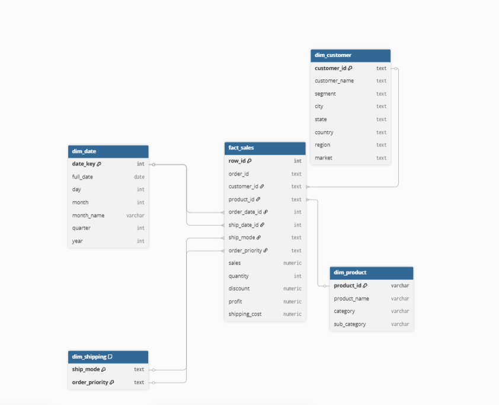
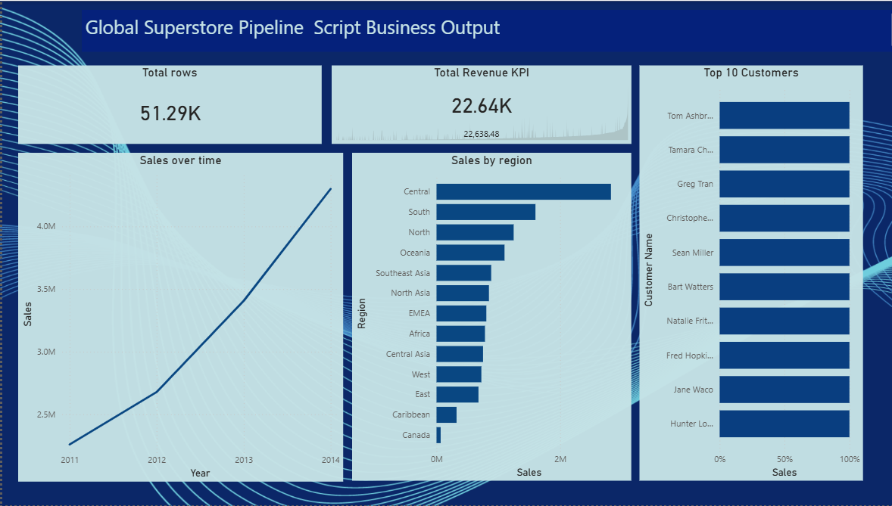

# Global Superstore Data Warehouse


# Overview
This project builds a fully reproducible SQL pipeline that transform raw CSV dataset into analytics ready fact and dimension tables inside PostgreSQL. It includes:
- A cleaning layer (clean_zone) to standardize raw data.
- An analytics schema (global_superstore_analytics) with dimension and fact tables.
- A fact table at the grain of one row per order line item, enabling flexible reporting and BI analysis.
- Validating pipleline script with SQL aggregation queries and visualization of outputs in Power BI

# Architecture
1. Raw Zone
- Source: raw_zone.global_superstore_raw
- Contains unprocessed transactional data.
2. Clean Zone
- Table: clean_zone.global_superstore_clean
- Cleans and transforms raw data:
- Casts dates (order_date, ship_date)
- Handles empty postal codes (NULLIF)
- Deduplicates rows (SELECT DISTINCT)
- Ensures idempotent updates (ON CONFLICT)
3. Analytics Schema
- Schema: global_superstore_analytics
- Dimensions:
- dim_customer: Customer attributes (ID, name, segment, geography)
- dim_product: Product attributes (ID, name, category, sub-category)
- dim_shipping: Shipping mode and order priority
- dim_date: Calendar attributes (day, month, year, quarter, week)
- Fact Table:
- fact_sales: Measures (sales, quantity, discount, profit, shipping cost)
- Foreign keys link to dimensions

## Schema Setup
```
                dim_customer
                   |
                   | customer_id
                   |
fact_sales ---- dim_product
     |              |
     | product_id   |
     |
     | order_date_id, ship_date_id
     |
   dim_date

fact_sales ---- dim_shipping (ship_mode, order_priority) 
```


## Tools
- Excel
- PostgreSQL
- Power BI
- diagram.io

## Example Queries
- Sales by Category and Year
SELECT p.category, d.year, SUM(f.sales) AS total_sales
FROM global_superstore_analytics.fact_sales f
JOIN global_superstore_analytics.dim_product p ON f.product_id = p.product_id
JOIN global_superstore_analytics.dim_date d ON f.order_date_id = d.date_id
GROUP BY p.category, d.year
ORDER BY d.year, total_sales DESC;

- Profitability by Shipping Mode
SELECT s.ship_mode, SUM(f.profit) AS total_profit
FROM global_superstore_analytics.fact_sales f
JOIN global_superstore_analytics.dim_shipping s
  ON f.ship_mode = s.ship_mode AND f.order_priority = s.order_priority
GROUP BY s.ship_mode
ORDER BY total_profit DESC;

## Visualization
Card - Total rows
Line - Sales over time
Bar - Sales by region
Bar - Top N customers
KPI card - Total revenue


## Project Structure
```
├── sql_scripts/
│   ├── 01_schema_setup.sql
│   ├── 02_raw_data.sql
│   ├── 03_clean_transform.sql
│   ├── 04_analytics_model.sql
│   ├── 05_validation_queries.sql
│   └── full_global_superstore_script.sql
├── data_warehouse_erd.png
├── dashboard.png
├── README.md
└── raw_zone/ (source data)
```


## Getting Started
- Load raw data into raw_zone.global_superstore_raw.
- Run 01_clean_zone.sql to populate the clean zone.
- Execute dimension scripts (02–05) to build dimensions.
- Run 06_fact_sales.sql to populate the fact table.
- Connect your BI tool to global_superstore_analytics to visualize.



